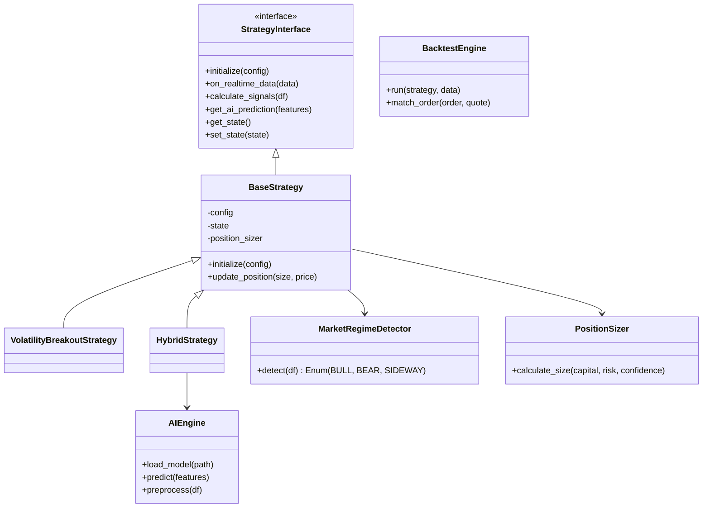

# 전략 및 AI 엔진 상세 설계 (Strategy & AI Engine Design)

## 1. 개요 (Overview)
전략 및 AI 엔진은 시장 데이터(`Data Layer`)를 입력받아 매수/매도 신호를 생성하고, 자금 관리 규칙에 따라 주문 수량을 결정하는 핵심 두뇌 역할을 합니다. 단순한 기술적 지표뿐만 아니라 AI 모델의 예측 결과를 결합하여 고도화된 트레이딩을 수행합니다.

## 2. 사용자 결정 사항 (User Decisions)
1.  **AI 모델 프레임워크**: **PyTorch + Scikit-learn 둘 다 지원**.
2.  **리스크 관리**: **사용자 설정 가능** (기본값 제공, 설정 파일에서 변경 가능).
3.  **백테스팅 정밀도**: **사용자 설정 가능** (Tick vs 1분봉 선택 가능).
4.  **데이터 보관**: **매 분 + 거래 발생 시** 저장.

## 3. 아키텍처 (Architecture)



## 4. 주요 컴포넌트 상세 설계

### 4.1. 데이터 구조 (Data Structures)

#### Signal (신호)
전략이 생성하는 매매 신호 객체입니다.
```python
@dataclass
class Signal:
    symbol: str
    type: str  # 'BUY', 'SELL', 'EXIT'
    price: float  # 신호 발생 시점의 가격
    timestamp: datetime
    reason: str  # 진입/청산 근거 (예: "RSI < 30", "AI Score > 0.8")
    score: float = 0.0  # AI 예측 점수 또는 지표 강도 (0.0 ~ 1.0)
```

#### StrategyState (전략 상태)
DB에 저장되어 프로그램 재시작 시 복원되는 상태 정보입니다.
```python
@dataclass
class StrategyState:
    strategy_id: str
    symbol: str
    current_position: int  # 보유 수량 (+: 매수, -: 매도, 0: 무포지션)
    avg_entry_price: float  # 평단가
    accumulated_profit: float  # 누적 실현 손익
    indicators: dict  # 현재 지표 값 (예: {"RSI": 35.5, "MA20": 60000})
    last_update: datetime
```

### 4.2. Strategy Interface & Base Class
- **`on_realtime_data(data)` 로직**:
    1.  데이터 수신 (Tick/Bar).
    2.  `IndicatorEngine` 호출 -> 지표 업데이트.
    3.  `MarketRegimeDetector` 호출 -> 시장 국면 판단.
    4.  `calculate_signals()` 호출 -> 매수/매도 로직 수행.
    5.  신호 발생 시 `PositionSizer` 호출 -> 수량 계산.
    6.  `Signal` 객체 생성 및 반환 (Execution 모듈로 전달).

### 4.3. AI Engine 상세
- **Model Loader**:
    - 파일 확장자로 프레임워크 자동 감지 (`.pt` -> PyTorch, `.pkl` -> Sklearn).
    - 메타데이터 파일(`model_config.json`)을 함께 로드하여 입력 Feature 목록과 전처리 파라미터(Scaler의 mean/std 등)를 확인.
- **Inference**:
    - 실시간 데이터가 들어오면, 메타데이터에 정의된 Feature를 추출 및 정규화.
    - 모델 추론 실행 -> 확률값(`prob`) 반환.
    - `HybridStrategy`에서 `if prob > threshold:` 로직으로 활용.

### 4.4. Market Regime Detector (시장 국면 탐지)
- **알고리즘 상세**:
    - **추세장(Trending)**: `ADX(14) > 25` AND `MA(20) 기울기 > 임계값`.
    - **횡보장(Ranging)**: `ADX(14) <= 25` OR `Bollinger Band 폭 < 임계값`.
    - **변동성장(Volatile)**: `ATR(14) / Close > 0.02` (2% 이상 변동).
- **활용**:
    - 추세장 -> 이평선 교차, 돌파 전략 비중 확대.
    - 횡보장 -> RSI 역추세, 볼린저 밴드 회귀 전략 비중 확대.

### 4.5. Position Sizer (자금 관리)
- **Kelly Criterion (켈리 공식)**:
    - $f = \frac{bp - q}{b}$
    - $b$: 배당률(손익비), $p$: 승률, $q$: 패율($1-p$).
    - AI 모델이 예측한 승률($p$)을 대입하여 최적 비중 계산.
- **Risk-Based Sizing**:
    - `Size = (Capital * Risk_Per_Trade) / (Entry_Price - Stop_Loss)`
    - 예: 자본 1000만원, 리스크 1%(10만원), 진입 10000원, 손절 9500원(500원 차이) -> 100,000 / 500 = 200주 매수.

### 4.6. Event-Driven Backtester
- **구조**:
    - `EventQueue`: 시간 순서대로 정렬된 틱/분봉 데이터 큐.
    - `OrderBook`: 가상의 호가창 유지.
- **체결 시뮬레이션**:
    - 매수 주문 시: `Ask(매도호가)`에 물량이 있는지 확인 후 체결.
    - 매도 주문 시: `Bid(매수호가)`에 물량이 있는지 확인 후 체결.
    - 슬리피지: 시장가 주문 시 최우선 호가보다 1~2틱 불리한 가격 체결 가정.

## 5. 데이터 흐름 (Data Flow)

1.  **데이터 수신**: `DataCollector` -> `StrategyEngine`.
2.  **지표 계산**: `IndicatorEngine`을 통해 기술적 지표 업데이트.
3.  **국면 탐지**: `MarketRegimeDetector`가 현재 시장 상태 판단.
4.  **AI 추론**: (Hybrid 전략의 경우) `AIEngine`이 상승 확률 예측.
5.  **신호 생성**: 전략 로직에 따라 매수/매도 신호 발생.
6.  **수량 계산**: `PositionSizer`가 리스크 허용 범위 내 수량 결정.
7.  **주문 전송**: `ExecutionModule`로 주문 요청 전달.

## 6. 구현 단계 (Implementation Steps)

1.  **기반 구축**: `StrategyInterface`, `BaseStrategy` 구현.
2.  **기본 전략**: `VolatilityBreakout`, `RSI` 등 고전 전략 구현.
3.  **AI 연동**: `AIEngine` 구현 및 `HybridStrategy` 개발.
4.  **고도화**: `MarketRegimeDetector`, `PositionSizer` 구현.
5.  **검증**: `BacktestEngine` 구현 및 시뮬레이션 수행.
6.  **최적화**: `StrategyOptimizer`를 통한 파라미터 튜닝.
