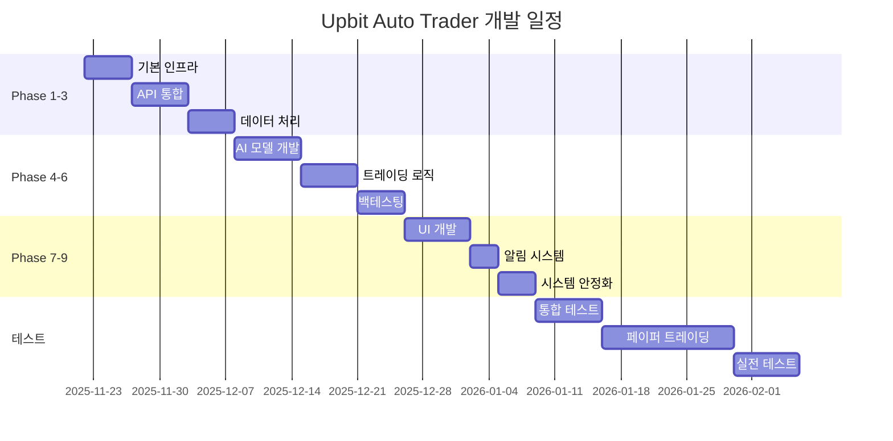

# Upbit 자동매매 프로그램 - 개발 계획 요약

**전체 개발 기간**: 약 16주 (4개월)

---

## 📋 Phase별 요약

### Phase 1: 기본 인프라 구축 (3-5일)

**목표**: 프로젝트 기반 구조 및 개발 환경 설정

**주요 작업**:
- ✅ 프로젝트 폴더 구조 생성
- ✅ 의존성 패키지 관리 (`requirements.txt`)
- ✅ 환경 설정 시스템 (`.env`, `config.py`)
- ✅ SQLite 데이터베이스 스키마 설계
- ✅ 기본 유틸리티 (로깅, 에러 핸들러)

**산출물**:
- [phase1_infrastructure.md](file:///C:/Users/PainGZ/.gemini/antigravity/brain/cd0a3db4-0b92-4093-b6b2-5b19637b957c/phase1_infrastructure.md)

**다음 단계**: API 키 발급 및 Upbit API 연동 준비

---

### Phase 2: Upbit API 통합 (4-6일)

**목표**: REST API 및 WebSocket API 완전 통합

**주요 작업**:
- ✅ REST API 래퍼 (`upbit_api.py`)
  - 시장 정보, 계좌 조회, 주문 관리
- ✅ WebSocket 실시간 데이터 (`upbit_websocket.py`)
  - 실시간 시세, 호가, 체결
- ✅ Rate Limiting 관리
- ✅ 에러 처리 및 자동 재연결

**산출물**:
- [phase2_api_integration.md](file:///C:/Users/PainGZ/.gemini/antigravity/brain/cd0a3db4-0b92-4093-b6b2-5b19637b957c/phase2_api_integration.md)

**다음 단계**: 과거 데이터 수집 시작

---

### Phase 3: 데이터 수집 및 처리 (4-5일)

**목표**: 시장 데이터 수집 및 기술적 지표 계산

**주요 작업**:
- ✅ OHLCV 데이터 수집 (`market_data.py`)
- ✅ 기술적 지표 계산 (`indicators.py`)
  - MA, RSI, MACD, 볼린저밴드, 스토캐스틱, ATR, OBV, ADX
- ✅ 데이터 전처리 (`preprocessor.py`)
- ✅ 캐싱 시스템 (`cache_manager.py`)
- ✅ 데이터 파이프라인 통합

**산출물**:
- [phase3_data_processing.md](file:///C:/Users/PainGZ/.gemini/antigravity/brain/cd0a3db4-0b92-4093-b6b2-5b19637b957c/phase3_data_processing.md)

**다음 단계**: AI 모델 학습 데이터 준비

---

### Phase 4: AI 모델 개발 (5-7일)

**목표**: 딥러닝 기반 가격 예측 모델 구축

**주요 작업**:
- ✅ LSTM/GRU 모델 아키텍처 (`model.py`)
- ✅ 학습 데이터 생성 (`data_generator.py`)
- ✅ 모델 학습 파이프라인 (`trainer.py`)
- ✅ 실시간 예측 서비스 (`predictor.py`)
- ✅ 모델 평가 및 검증 (`evaluator.py`)
- ✅ 자동 재학습 스케줄러

**산출물**:
- [phase4_ai_model.md](file:///C:/Users/PainGZ/.gemini/antigravity/brain/cd0a3db4-0b92-4093-b6b2-5b19637b957c/phase4_ai_model.md)

**다음 단계**: AI 신호 기반 트레이딩 전략 구현

---

### Phase 5: 트레이딩 로직 (4-6일)

**목표**: 실제 주문 실행 및 리스크 관리

**주요 작업**:
- ✅ 트레이딩 엔진 (`engine.py`)
  - 매수/매도 실행, 포지션 관리
- ✅ 전략 관리 (`strategy.py`)
  - AI 전략, RSI 전략, 복합 전략
- ✅ 리스크 관리 (`risk_manager.py`)
  - 포지션 사이즈, 손절/익절, 일일 손실 한도

**산출물**: [phase5-9_integrated.md](file:///C:/Users/PainGZ/.gemini/antigravity/brain/cd0a3db4-0b92-4093-b6b2-5b19637b957c/phase5-9_integrated.md) (Phase 5 섹션)

**다음 단계**: 백테스팅으로 전략 검증

---

### Phase 6: 백테스팅 시스템 (4-5일)

**목표**: 전략 검증 및 성과 분석

**주요 작업**:
- ✅ 백테스팅 엔진 (`backtester.py`)
  - 과거 데이터 기반 시뮬레이션
  - 성과 지표 (수익률, 승률, MDD, 샤프 비율)
- ✅ 전략 최적화 (`optimizer.py`)
  - 그리드 서치, 랜덤 서치
  - 파라미터 튜닝
- ✅ 결과 시각화 및 리포트

**산출물**: [phase5-9_integrated.md](file:///C:/Users/PainGZ/.gemini/antigravity/brain/cd0a3db4-0b92-4093-b6b2-5b19637b957c/phase5-9_integrated.md) (Phase 6 섹션)

**다음 단계**: UI 개발 시작

---

### Phase 7: 사용자 인터페이스 (6-7일)

**목표**: PyQt5 기반 직관적인 GUI 구축

**주요 작업**:
- ✅ 메인 윈도우 (`main_window.py`)
- ✅ 대시보드 (`dashboard.py`)
  - 계좌 정보, 포지션, 수익/손실
- ✅ 실시간 차트 (`chart_widget.py`)
  - 캔들 차트, 지표 오버레이, AI 예측
- ✅ 설정 대화상자 (`settings_dialog.py`)
- ✅ 백테스팅 UI (`backtest_window.py`)

**산출물**: [phase5-9_integrated.md](file:///C:/Users/PainGZ/.gemini/antigravity/brain/cd0a3db4-0b92-4093-b6b2-5b19637b957c/phase5-9_integrated.md) (Phase 7 섹션)

**다음 단계**: 알림 시스템 통합

---

### Phase 8: 알림 및 모니터링 (2-3일)

**목표**: 카카오톡 알림 및 로깅 시스템

**주요 작업**:
- ✅ 카카오톡 알림 (`kakao_notify.py`)
  - 거래 체결, 손익, 시스템 에러 알림
- ✅ 로깅 시스템 강화
  - 거래 전용 로그, 로그 압축

**산출물**: [phase5-9_integrated.md](file:///C:/Users/PainGZ/.gemini/antigravity/brain/cd0a3db4-0b92-4093-b6b2-5b19637b957c/phase5-9_integrated.md) (Phase 8 섹션)

**다음 단계**: 시스템 안정성 테스트

---

### Phase 9: 시스템 안정성 (3-4일)

**목표**: 24/7 안정적 운영 보장

**주요 작업**:
- ✅ 전역 에러 핸들러 강화
- ✅ 자동 재연결 로직
- ✅ 헬스 체크 시스템 (`health_checker.py`)
- ✅ 메인 애플리케이션 (`main.py`)
- ✅ 24시간 안정성 테스트

**산출물**: [phase5-9_integrated.md](file:///C:/Users/PainGZ/.gemini/antigravity/brain/cd0a3db4-0b92-4093-b6b2-5b19637b957c/phase5-9_integrated.md) (Phase 9 섹션)

**다음 단계**: 통합 테스트 및 배포 준비

---

## 🎯 개발 로드맵 타임라인



---

## 📚 문서 인덱스

### 전체 계획
- [implementation_plan.md](file:///C:/Users/PainGZ/.gemini/antigravity/brain/cd0a3db4-0b92-4093-b6b2-5b19637b957c/implementation_plan.md) - 전체 개발 계획 개요

### Phase별 상세 계획
1. [phase1_infrastructure.md](file:///C:/Users/PainGZ/.gemini/antigravity/brain/cd0a3db4-0b92-4093-b6b2-5b19637b957c/phase1_infrastructure.md) - 기본 인프라 구축
2. [phase2_api_integration.md](file:///C:/Users/PainGZ/.gemini/antigravity/brain/cd0a3db4-0b92-4093-b6b2-5b19637b957c/phase2_api_integration.md) - Upbit API 통합
3. [phase3_data_processing.md](file:///C:/Users/PainGZ/.gemini/antigravity/brain/cd0a3db4-0b92-4093-b6b2-5b19637b957c/phase3_data_processing.md) - 데이터 수집 및 처리
4. [phase4_ai_model.md](file:///C:/Users/PainGZ/.gemini/antigravity/brain/cd0a3db4-0b92-4093-b6b2-5b19637b957c/phase4_ai_model.md) - AI 모델 개발
5. [phase5-9_integrated.md](file:///C:/Users/PainGZ/.gemini/antigravity/brain/cd0a3db4-0b92-4093-b6b2-5b19637b957c/phase5-9_integrated.md) - 트레이딩, 백테스팅, UI, 알림, 안정성

### 작업 관리
- [task.md](file:///C:/Users/PainGZ/.gemini/antigravity/brain/cd0a3db4-0b92-4093-b6b2-5b19637b957c/task.md) - 작업 체크리스트

---

## ⚡ 빠른 시작 가이드

### 1단계: 개발 환경 준비
```bash
# 프로젝트 생성
cd e:\GitHub\UpbitTrader

# 가상 환경 생성
python -m venv venv
venv\Scripts\activate

# 의존성 설치
pip install -r requirements.txt
```

### 2단계: API 키 설정
```bash
# .env 파일 생성
cp .env.example .env

# API 키 입력 (텍스트 에디터로)
UPBIT_ACCESS_KEY=your_access_key
UPBIT_SECRET_KEY=your_secret_key
```

### 3단계: 데이터베이스 초기화
```bash
python -c "from database.db_manager import DatabaseManager; db = DatabaseManager('./database/trading.db'); db.initialize_database()"
```

### 4단계: API 연결 테스트
```bash
python test_connection.py
```

### 5단계: 데이터 수집
```bash
python -c "from data.pipeline import DataPipeline; pipeline = DataPipeline(api, db); df = pipeline.get_processed_data('KRW-BTC', days=30)"
```

### 6단계: AI 모델 학습
```bash
python ai/trainer.py
```

### 7단계: 백테스팅
```bash
python backtest/backtester.py
```

### 8단계: GUI 실행
```bash
python main.py
```

---

## 🔑 핵심 성공 요소

### 1. 충분한 테스트
- ✅ 백테스팅: 최소 6개월 이상 데이터
- ✅ 페이퍼 트레이딩: 2주 이상
- ✅ 실전 테스트: 소액(10만원 이하)부터 시작

### 2. 리스크 관리
- ✅ 손절 라인 설정 (5% 권장)
- ✅ 포지션 사이즈 제한
- ✅ 일일 손실 한도 설정
- ✅ 최대 동시 포지션 수 제한

### 3. 지속적 개선
- ✅ 주간 성과 분석
- ✅ AI 모델 정기 재학습 (주 1회)
- ✅ 전략 파라미터 조정
- ✅ 시장 변화 모니터링

### 4. 보안
- ✅ API 키 암호화 저장
- ✅ 출금 권한 제거
- ✅ 2FA 활성화
- ✅ 로그 접근 제한

---

## 📊 예상 성과 지표

### 목표 KPI
- **샤프 비율**: > 1.0
- **최대 낙폭 (MDD)**: < 15%
- **승률**: > 55%
- **월 평균 수익률**: 5-10%
- **시스템 가동률**: > 99%

### 모니터링 지표
- API 응답 시간
- 주문 체결 성공률
- AI 예측 정확도
- 메모리/CPU 사용률

---

## ⚠️ 주의사항

> [!CAUTION]
> **투자 경고**
> - 암호화폐는 변동성이 매우 높습니다
> - 과거 성과가 미래 수익을 보장하지 않습니다
> - 잃어도 괜찮은 금액만 투자하세요
> - AI가 항상 정확한 것은 아닙니다

> [!WARNING]
> **기술적 제약**
> - Upbit API Rate Limit: 초당 10회, 분당 600회
> - 네트워크 장애 시 거래 중단 가능
> - 서버 점검 시간 고려 필요
> - 시장 급변 시 슬리피지 발생 가능

> [!IMPORTANT]
> **법적 고지**
> - 본 프로그램은 교육 목적입니다
> - 투자 손실 책임은 사용자에게 있습니다
> - 관련 법규를 준수하세요
> - 세금 신고 의무를 이행하세요

---

## 🚀 다음 액션 아이템

### 즉시 수행
1. [ ] Upbit 계정 생성 (미보유 시)
2. [ ] API 키 발급
3. [ ] 프로젝트 폴더 생성
4. [ ] 개발 환경 설정

### 이번 주
1. [ ] Phase 1 구현 시작
2. [ ] API 연동 테스트
3. [ ] 데이터베이스 스키마 최종 검토
4. [ ] Git 저장소 초기화

### 이번 달
1. [ ] Phase 1-4 완료
2. [ ] AI 모델 첫 학습
3. [ ] 기본 전략 백테스팅
4. [ ] 코드 리뷰 및 최적화

---

## 📞 지원 및 문의

### 참고 자료
- [Upbit API 공식 문서](https://docs.upbit.com/)
- [pyupbit 라이브러리](https://github.com/sharebook-kr/pyupbit)
- [TensorFlow 튜토리얼](https://www.tensorflow.org/tutorials)
- [PyQt5 문서](https://doc.qt.io/qtforpython/)

### 커뮤니티
- GitHub Issues (버그 리포트)
- Wiki (FAQ 및 팁)
- Discussions (아이디어 공유)

---

**마지막 업데이트**: 2025-11-22

**버전**: 1.0

**상태**: ✅ 계획 완료 → 구현 대기
