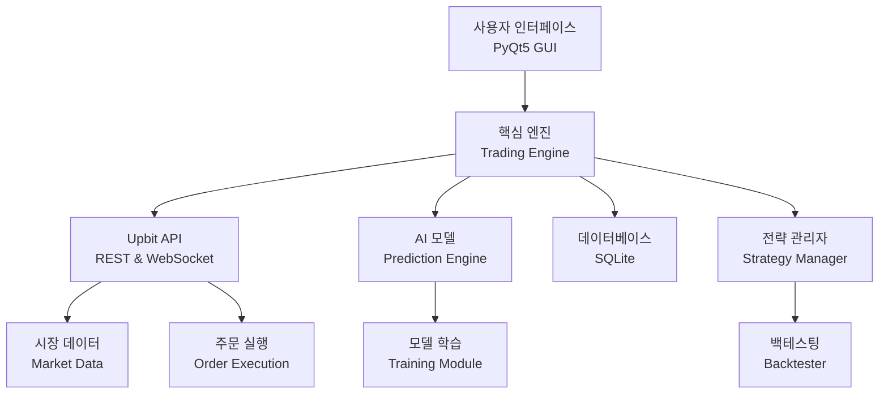

# Upbit 자동매매 프로그램 개발 계획

Upbit API를 활용한 AI 기반 암호화폐 자동매매 시스템 개발 계획서

## 프로젝트 개요

### 목표
프리미엄급 암호화폐 자동매매 시스템을 구축하여 다음을 실현합니다:
- **AI 기반 트레이딩**: 머신러닝 모델을 활용한 시장 예측 및 자동 매매
- **실시간 모니터링**: 시장 데이터 실시간 분석 및 시각화
- **리스크 관리**: 체계적인 손절/익절 및 포지션 관리
- **백테스팅**: 전략 검증 및 최적화 기능
- **사용자 친화적 UI**: PyQt5 기반 직관적인 인터페이스

### 배경 및 필요성
- 암호화폐 시장의 24/7 운영 특성상 자동화된 매매 시스템 필요
- 감정적 판단 배제 및 일관된 트레이딩 전략 실행
- AI 기술을 활용한 데이터 기반 의사결정
- 백테스팅을 통한 전략 검증 및 지속적 개선

---

## 기술 스택

### 핵심 기술
- **언어**: Python 3.9+
- **UI 프레임워크**: PyQt5
- **API**: Upbit REST API, Upbit WebSocket API
- **데이터베이스**: SQLite
- **AI/ML**: TensorFlow/Keras, scikit-learn
- **데이터 분석**: pandas, numpy, TA-Lib
- **차트 시각화**: matplotlib, mplfinance, pyqtgraph

### 주요 라이브러리
```
pyupbit : Upbit API 래퍼
PyQt5 : GUI 프레임워크
pandas : 데이터 분석
numpy : 수치 계산
tensorflow : 딥러닝 모델
scikit-learn : 머신러닝
TA-Lib : 기술적 지표
requests : HTTP 통신
websocket-client : WebSocket 통신
python-dotenv : 환경 변수 관리
```

---

## 시스템 아키텍처

### 전체 구조


### 주요 컴포넌트

#### 1. UI Layer (사용자 인터페이스)
- 메인 대시보드
- 실시간 차트 및 시장 데이터
- 트레이딩 현황 모니터링
- 설정 및 전략 관리
- 로그 및 알림

#### 2. Trading Engine (거래 엔진)
- 시장 데이터 수집 및 처리
- 주문 생성 및 실행
- 포지션 관리
- 리스크 관리 (손절/익절)
- 예외 처리 및 에러 복구

#### 3. AI/ML Module (인공지능 모듈)
- 시장 예측 모델 (LSTM, GRU)
- 기술적 지표 분석
- 시그널 생성
- 모델 학습 및 업데이트

#### 4. Strategy Manager (전략 관리)
- 다양한 전략 구현
- 전략 백테스팅
- 파라미터 최적화
- 전략 성과 분석

#### 5. Data Layer (데이터 계층)
- 시장 데이터 저장
- 거래 이력 관리
- 설정 및 상태 저장
- 성과 분석 데이터

---

## 핵심 기능 명세

### Phase 1: 기본 인프라 구축
- [NEW] [project_setup.py](file:///e:/GitHub/UpbitTrader/project_setup.py)
  - 프로젝트 폴더 구조 생성
  - 의존성 패키지 설치 스크립트
  - 환경 설정 파일 템플릿

- [NEW] [config.py](file:///e:/GitHub/UpbitTrader/config.py)
  - API 키 관리
  - 시스템 설정 관리
  - 환경 변수 로드

- [NEW] [database/db_manager.py](file:///e:/GitHub/UpbitTrader/database/db_manager.py)
  - SQLite 데이터베이스 초기화
  - 테이블 스키마 정의
  - CRUD 작업 인터페이스

### Phase 2: Upbit API 통합
- [NEW] [api/upbit_api.py](file:///e:/GitHub/UpbitTrader/api/upbit_api.py)
  - REST API 래퍼 클래스
  - 시장 데이터 조회 (현재가, 호가, 체결)
  - 계좌 정보 조회
  - 주문 생성/조회/취소
  - API 요청 제한 관리 (Rate Limiting)

- [NEW] [api/upbit_websocket.py](file:///e:/GitHub/UpbitTrader/api/upbit_websocket.py)
  - WebSocket 연결 관리
  - 실시간 시세 수신
  - 실시간 호가 수신
  - 실시간 체결 수신
  - 자동 재연결 로직

### Phase 3: 데이터 수집 및 처리
- [NEW] [data/market_data.py](file:///e:/GitHub/UpbitTrader/data/market_data.py)
  - OHLCV 데이터 수집
  - 기술적 지표 계산 (MA, RSI, MACD, 볼린저밴드 등)
  - 데이터 정규화 및 전처리
  - 데이터베이스 저장

- [NEW] [data/indicators.py](file:///e:/GitHub/UpbitTrader/data/indicators.py)
  - 다양한 기술적 지표 구현
  - 커스텀 지표 생성 지원
  - 지표 조합 및 필터링

### Phase 4: AI 모델 개발
- [NEW] [ai/model.py](file:///e:/GitHub/UpbitTrader/ai/model.py)
  - LSTM/GRU 기반 가격 예측 모델
  - 모델 아키텍처 정의
  - 학습 파라미터 설정

- [NEW] [ai/trainer.py](file:///e:/GitHub/UpbitTrader/ai/trainer.py)
  - 모델 학습 파이프라인
  - 데이터 증강 및 검증
  - 모델 평가 및 저장
  - 자동 재학습 스케줄러

- [NEW] [ai/predictor.py](file:///e:/GitHub/UpbitTrader/ai/predictor.py)
  - 실시간 예측 서비스
  - 신호 생성 (매수/매도/관망)
  - 신뢰도 점수 계산

### Phase 5: 트레이딩 로직
- [NEW] [trading/engine.py](file:///e:/GitHub/UpbitTrader/trading/engine.py)
  - 거래 엔진 메인 클래스
  - 주문 실행 로직
  - 포지션 관리
  - 리스크 관리 (손절/익절)

- [NEW] [trading/strategy.py](file:///e:/GitHub/UpbitTrader/trading/strategy.py)
  - 기본 전략 베이스 클래스
  - AI 기반 전략
  - 기술적 지표 기반 전략
  - 스캘핑 전략
  - 스윙 트레이딩 전략

- [NEW] [trading/risk_manager.py](file:///e:/GitHub/UpbitTrader/trading/risk_manager.py)
  - 포지션 사이즈 계산
  - 손절/익절 자동 설정
  - 최대 손실 제한
  - 일일 거래 횟수 제한

### Phase 6: 백테스팅 시스템
- [NEW] [backtest/backtester.py](file:///e:/GitHub/UpbitTrader/backtest/backtester.py)
  - 과거 데이터 기반 전략 테스트
  - 성과 지표 계산 (수익률, MDD, 샤프비율 등)
  - 거래 이력 시뮬레이션
  - 결과 리포트 생성

- [NEW] [backtest/optimizer.py](file:///e:/GitHub/UpbitTrader/backtest/optimizer.py)
  - 전략 파라미터 최적화
  - 그리드 서치 / 랜덤 서치
  - 유전 알고리즘 기반 최적화
  - 최적 파라미터 저장

### Phase 7: 사용자 인터페이스
- [NEW] [ui/main_window.py](file:///e:/GitHub/UpbitTrader/ui/main_window.py)
  - 메인 윈도우 레이아웃
  - 메뉴 바 및 툴바
  - 상태 표시줄

- [NEW] [ui/dashboard.py](file:///e:/GitHub/UpbitTrader/ui/dashboard.py)
  - 실시간 대시보드
  - 계좌 잔고 표시
  - 현재 포지션 현황
  - 수익/손실 현황

- [NEW] [ui/chart_widget.py](file:///e:/GitHub/UpbitTrader/ui/chart_widget.py)
  - 실시간 캔들 차트
  - 기술적 지표 오버레이
  - AI 예측 시각화
  - 매매 시그널 표시

- [NEW] [ui/settings_dialog.py](file:///e:/GitHub/UpbitTrader/ui/settings_dialog.py)
  - API 키 설정
  - 전략 파라미터 설정
  - 리스크 관리 설정
  - 알림 설정

- [NEW] [ui/backtest_window.py](file:///e:/GitHub/UpbitTrader/ui/backtest_window.py)
  - 백테스팅 설정 UI
  - 결과 시각화
  - 성과 분석 리포트

### Phase 8: 알림 및 모니터링
- [NEW] [notification/kakao_notify.py](file:///e:/GitHub/UpbitTrader/notification/kakao_notify.py)
  - 카카오톡 알림 (선택사항)
  - 거래 체결 알림
  - 손익 알림
  - 시스템 에러 알림

- [NEW] [utils/logger.py](file:///e:/GitHub/UpbitTrader/utils/logger.py)
  - 로깅 시스템
  - 파일 및 콘솔 출력
  - 로그 레벨 관리
  - 로그 순환 (Rotation)

### Phase 9: 시스템 안정성
- [NEW] [utils/error_handler.py](file:///e:/GitHub/UpbitTrader/utils/error_handler.py)
  - 전역 에러 핸들링
  - API 에러 복구
  - 네트워크 장애 대응
  - 자동 재시작 로직

- [NEW] [main.py](file:///e:/GitHub/UpbitTrader/main.py)
  - 애플리케이션 진입점
  - 초기화 및 시작 로직
  - 종료 처리

---

## 개발 일정 계획

### Week 1-2: 프로젝트 기반 구축
- ✅ 프로젝트 구조 생성
- ✅ 개발 환경 설정
- ✅ Upbit API 연동 테스트
- ✅ 데이터베이스 스키마 설계
- ✅ 기본 설정 시스템 구현

### Week 3-4: 데이터 수집 모듈
- 📊 시장 데이터 수집 로직
- 📊 WebSocket 실시간 데이터 수신
- 📊 기술적 지표 계산 모듈
- 📊 데이터 저장 및 관리

### Week 5-6: AI 모델 개발
- 🤖 데이터 전처리 파이프라인
- 🤖 LSTM/GRU 모델 설계 및 학습
- 🤖 모델 평가 및 튜닝
- 🤖 예측 서비스 구현

### Week 7-8: 트레이딩 엔진
- 💼 주문 실행 로직
- 💼 포지션 관리 시스템
- 💼 리스크 관리 모듈
- 💼 전략 구현 (기본 + AI)

### Week 9-10: 백테스팅 시스템
- 📈 백테스팅 엔진 구현
- 📈 성과 분석 모듈
- 📈 파라미터 최적화 도구
- 📈 리포트 생성

### Week 11-12: UI 개발
- 🎨 메인 윈도우 및 레이아웃
- 🎨 대시보드 구현
- 🎨 실시간 차트 위젯
- 🎨 설정 및 백테스팅 UI

### Week 13-14: 통합 및 테스트
- 🧪 모듈 통합 테스트
- 🧪 종단 간 테스트
- 🧪 버그 수정 및 최적화
- 🧪 문서화

### Week 15-16: 배포 및 최적화
- 🚀 실전 테스트 (소액)
- 🚀 성능 최적화
- 🚀 사용자 가이드 작성
- 🚀 최종 배포 준비

---

## 위험 요소 및 대응 방안

### 기술적 위험

#### 1. API 제한 및 안정성
> [!WARNING]
> Upbit API는 요청 제한(Rate Limiting)이 있으며, 과도한 요청 시 일시적으로 차단될 수 있습니다.

**대응 방안:**
- API 요청 큐 시스템 구현
- 요청 간격 자동 조절
- 캐싱 메커니즘 도입
- WebSocket 우선 활용

#### 2. 네트워크 장애
> [!CAUTION]
> 실시간 트레이딩 중 네트워크 장애 발생 시 손실 위험이 있습니다.

**대응 방안:**
- 자동 재연결 로직
- 오프라인 모드 대비
- 로컬 데이터 캐싱
- 장애 발생 시 긴급 청산 옵션

#### 3. AI 모델 성능
> [!IMPORTANT]
> AI 모델의 예측 정확도가 실제 수익률을 보장하지 않습니다.

**대응 방안:**
- 충분한 백테스팅
- 실전 투입 전 페이퍼 트레이딩
- 모델 성능 모니터링
- 다중 전략 포트폴리오

### 금융적 위험

#### 4. 시장 변동성
> [!CAUTION]
> 암호화폐 시장의 높은 변동성으로 인한 급격한 손실 가능성이 있습니다.

**대응 방안:**
- 엄격한 손절 규칙
- 포지션 사이즈 제한
- 최대 일일 손실 한도 설정
- 변동성 지표 기반 거래 중단

#### 5. 과최적화 (Overfitting)
> [!WARNING]
> 백테스팅에서 좋은 성과가 실전에서 재현되지 않을 수 있습니다.

**대응 방안:**
- 아웃오브샘플 테스트
- 워크포워드 분석
- 다양한 시장 상황 테스트
- 보수적인 파라미터 선택

### 운영적 위험

#### 6. 보안 및 API 키 관리
> [!CAUTION]
> API 키 유출 시 자산 손실 위험이 있습니다.

**대응 방안:**
- 환경 변수 사용
- API 키 암호화 저장
- 읽기 전용 키 우선 사용
- 출금 권한 분리

#### 7. 시스템 다운타임
> [!WARNING]
> 프로그램 오류나 시스템 재시작으로 인한 거래 중단 가능성이 있습니다.

**대응 방안:**
- 포지션 상태 자동 저장
- 재시작 시 상태 복구
- 예외 처리 강화
- 헬스 체크 및 자동 재시작

---

## 검증 계획

### 단계별 테스트

#### 1. 단위 테스트
- 각 모듈별 기능 검증
- API 호출 테스트
- 데이터 처리 로직 검증
- AI 모델 입출력 테스트

#### 2. 통합 테스트
- 모듈 간 연동 테스트
- 데이터 흐름 검증
- 주문 실행 프로세스 테스트
- UI ↔ 백엔드 통신 테스트

#### 3. 백테스팅
- 과거 1년 이상 데이터로 전략 검증
- 다양한 시장 상황 시뮬레이션
- 성과 지표 분석 (샤프비율, MDD, Win Rate 등)
- 전략별 비교 분석

#### 4. 페이퍼 트레이딩 (모의 투자)
- 실시간 시장 데이터로 2주 이상 테스트
- 실제 거래 없이 주문 시뮬레이션
- 시스템 안정성 모니터링
- 성과 기록 및 분석

#### 5. 실전 테스트
- 소액으로 실제 거래 시작 (10만원 이하)
- 1-2주간 모니터링
- 문제점 파악 및 개선
- 점진적 투자금 증액

### 성공 기준
- ✅ 백테스팅 샤프비율 > 1.0
- ✅ 최대 낙폭 (MDD) < 15%
- ✅ 페이퍼 트레이딩 2주 안정 운영
- ✅ API 에러율 < 1%
- ✅ 시스템 가동률 > 99%

---

## 추가 고려사항

### 확장 가능성
- 🌐 다중 거래소 지원 (Binance, Bithumb 등)
- 🤖 더 고급 AI 모델 (Transformer, Reinforcement Learning)
- 📱 모바일 알림 및 모니터링
- ☁️ 클라우드 배포 (24/7 운영)
- 📊 더 다양한 전략 추가

### 커뮤니티 및 지원
- 📖 상세한 사용자 매뉴얼
- 🎥 비디오 튜토리얼
- 💬 사용자 커뮤니티
- 🐛 버그 리포트 시스템
- 🔄 정기적 업데이트

### 규제 준수
- ⚖️ 한국 금융 규제 확인
- 📜 이용 약관 및 면책 조항
- 🔒 개인정보 보호
- 📋 거래 기록 보관

---

## 참고 자료

### API 문서
- [Upbit API 공식 문서](https://docs.upbit.com/)
- [pyupbit 라이브러리](https://github.com/sharebook-kr/pyupbit)

### 기술 참고
- TensorFlow/Keras 문서
- TA-Lib 기술적 지표
- PyQt5 공식 문서

### 트레이딩 전략
- 기술적 분석 이론
- 리스크 관리 전략
- 포트폴리오 이론

---

## 결론

본 개발 계획서는 **Upbit 자동매매 프로그램**을 체계적으로 구축하기 위한 로드맵을 제시합니다. 

### 핵심 원칙
1. **안정성 우선**: 리스크 관리와 예외 처리를 최우선으로
2. **데이터 기반**: 충분한 백테스팅과 검증 후 실전 투입
3. **점진적 개선**: 작은 단위로 개발하고 지속적으로 개선
4. **보안 중시**: API 키 관리 및 자산 보호

### 다음 단계
1. ✅ 개발 환경 설정
2. ✅ 프로젝트 구조 생성
3. 🔄 Phase 1 구현 시작
4. 📝 상세 구현 계획 수립

> [!TIP]
> 이 계획서는 살아있는 문서입니다. 개발 과정에서 발견되는 새로운 요구사항이나 개선사항을 반영하여 지속적으로 업데이트하세요.
