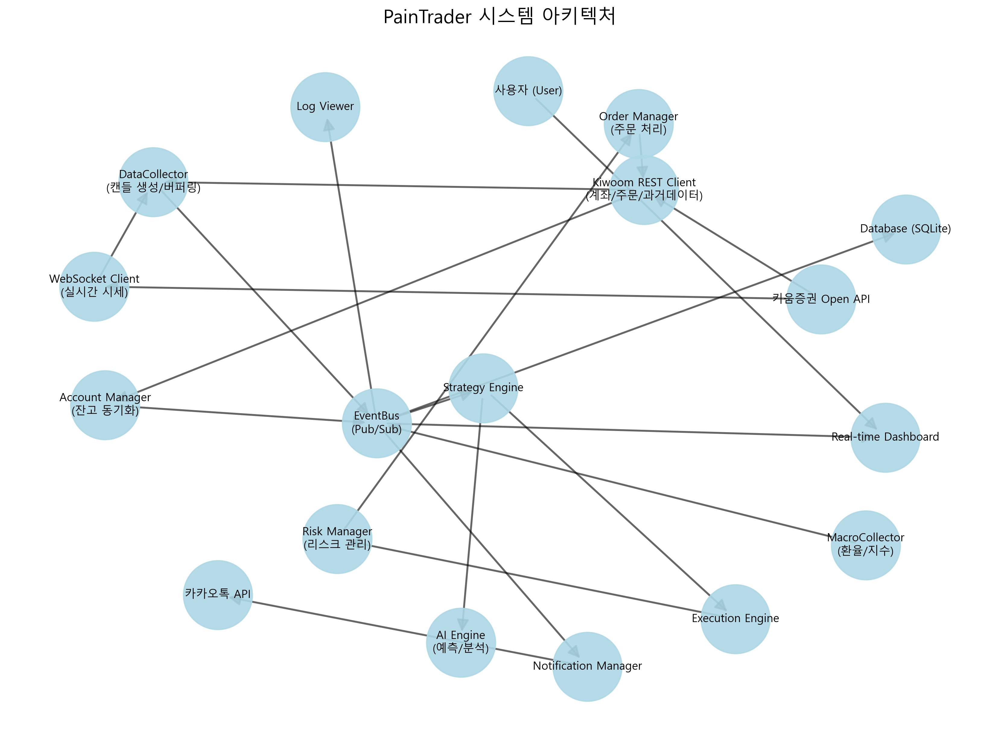

# PainTrader 시스템 데이터 흐름도

현재 구현된 시스템의 주요 모듈 간 데이터 흐름과 상호작용을 시각화한 다이어그램입니다.

## 전체 시스템 아키텍처

## 주요 프로세스 흐름

### 1. 데이터 수집 및 처리 (Data Pipeline)
1. **WebSocketClient**가 키움 API로부터 실시간 틱 데이터(체결, 호가)를 수신합니다.
2. **DataCollector**가 틱 데이터를 모아 1분봉(Candle)으로 가공(Aggregation)합니다.
3. 가공된 데이터는 **EventBus**를 통해 시스템 전체에 전파됩니다.

### 2. 전략 실행 및 신호 생성 (Strategy Loop)
1. **Strategy Engine**이 EventBus에서 새로운 시장 데이터를 구독합니다.
2. **Indicator Engine**을 통해 기술적 지표(RSI, MA, Bollinger 등)를 계산합니다.
3. **AI Engine**이 시장 국면을 분석하거나 가격을 예측합니다.
4. 전략 로직에 따라 매수/매도 **Signal**을 생성하여 Execution Engine으로 보냅니다.

### 3. 주문 실행 (Execution Pipeline)
1. **Execution Engine**이 신호를 받으면 **Risk Manager**에게 유효성을 검사받습니다 (예수금, 손실한도 확인).
2. 검증된 신호는 **Order Manager**를 통해 실제 주문으로 변환되어 **Kiwoom REST Client**로 전송됩니다.
3. **Account Manager**는 실시간 잔고와 수익률을 계산하여 업데이트합니다.

### 4. 사용자 인터페이스 (UI)
1. 모든 주요 이벤트(가격 변동, 주문 체결, 로그)는 EventBus를 통해 **UI(Dashboard, LogViewer)**에 실시간으로 반영됩니다.
2. 사용자는 **Control Panel**을 통해 봇을 시작/중지하거나 수동 주문을 내릴 수 있습니다.
