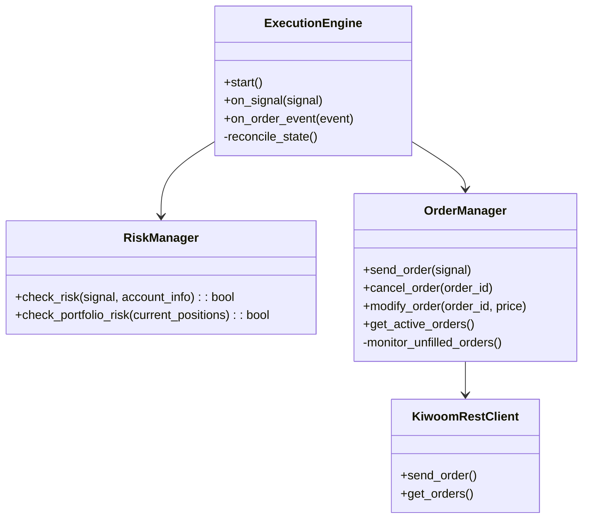

# 실행 모듈 상세 설계 (Execution Module Design)

## 1. 개요 (Overview)
실행 모듈은 전략 모듈에서 생성된 신호(`Signal`)를 받아 실제 거래소(Kiwoom API)로 주문을 전송하고, 체결 상태를 관리하며, 계좌 및 포트폴리오 리스크를 통제하는 역할을 수행합니다.

## 2. 아키텍처 (Architecture)



## 3. 주요 컴포넌트 상세

### 3.1. Risk Manager (리스크 관리자)
전략 레벨(`PositionSizer`)이 개별 종목의 수량을 결정한다면, `RiskManager`는 **계좌 전체 및 포트폴리오 레벨**의 안전장치 역할을 합니다.

*   **주요 기능**:
    1.  **예수금 확인**: 주문 가능 금액 초과 여부 확인.
    2.  **일일 손실 한도 (Daily Loss Limit)**: 당일 실현 손실 + 평가 손실이 설정된 한도(예: 자본금의 3%)를 넘으면 신규 진입 차단.
    3.  **주문 횟수 제한**: 과도한 매매(Churning) 방지를 위해 분당/일일 주문 횟수 제한.
    4.  **포트폴리오 노출도 제한**: 특정 섹터나 자산군에 대한 쏠림 방지 (예: 코스닥 종목 비중 70% 이하).

### 3.2. Order Manager (주문 관리자)
주문의 생성부터 체결 완료까지의 생명주기(Lifecycle)를 관리합니다.

*   **주요 기능**:
    1.  **주문 전송**: 지정가/시장가 주문 실행.
    2.  **미체결 감시 (Unfilled Monitoring)**:
        *   주문 후 N초(예: 60초) 동안 체결되지 않으면 **자동 취소** 또는 **호가 정정(Chase)**.
        *   `Chase` 로직: 매수 주문 미체결 시, 현재 1호가로 가격 정정하여 재주문.
    3.  **분할 주문 (Split Order)**: 대량 주문 시 시장 충격을 줄이기 위해 여러 번 나누어 주문 (TWAP/VWAP - 추후 고도화).
    4.  **주문 영속성 (Persistence)**:
        *   모든 활성 주문(Active Orders)을 DB(`active_orders` 테이블)에 실시간 저장.
        *   프로그램 비정상 종료 후 재시작 시, DB에서 주문 정보를 복원하여 미체결 감시 재개.

### 3.3. Execution Engine (실행 엔진)
전략과 실행 모듈 간의 조율자(Orchestrator)입니다.

*   **주요 기능**:
    1.  **신호 수신 및 처리**: `StrategyEngine`으로부터 `Signal` 수신 -> `RiskManager` 검사 -> `OrderManager` 실행.
    2.  **동기화 (Reconciliation)**:
        *   프로그램 시작 시 또는 주기적으로 거래소 잔고/미체결 내역을 조회하여 내부 상태와 동기화.
        *   "전략은 매수 상태인데 실제 계좌엔 주식이 없는" 불일치 상황 감지 및 알림/자동청산.

### 3.5. Account Manager (계좌 관리자)
실시간 잔고, 보유 종목, 수익률을 관리하고 거래소(또는 가상 거래소)와 동기화합니다.

*   **주요 기능**:
    1.  **잔고 동기화**:
        *   `REAL`: `KiwoomRestClient.get_account_balance()`를 주기적으로 호출하여 예수금 및 보유 종목 업데이트.
        *   `PAPER`: `PaperExchange`의 상태를 실시간 반영.
    2.  **수익률 계산**:
        *   실시간 평가 손익(Unrealized PnL) 및 실현 손익(Realized PnL) 계산.
        *   일별 수익률 기록 및 리포트 생성 데이터 제공.
    3.  **자산 배분 모니터링**:
        *   현재 현금 비중 vs 주식 비중 계산.
        *   `RiskManager`가 포트폴리오 리스크를 판단할 수 있도록 데이터 제공.

### 3.6. Notification (알림 시스템)
사용자에게 매매 체결, 에러, 일일 리포트 등 중요 정보를 전달합니다.

*   **채널**:
    1.  **KakaoTalk (카카오톡)**: 주요 알림 수단. `Kakao API`를 사용하여 "나에게 보내기" 기능 활용.
    2.  **Console/Log**: 모든 알림은 기본적으로 로그에도 기록.

*   **메시지 유형**:
    1.  **체결 알림**: 매수/매도 주문 체결 시 즉시 발송 (종목명, 수량, 가격, 수익률).
    2.  **에러 알림**: 시스템 크리티컬 에러 발생 시 발송 (API 연결 끊김, 주문 실패 등).
    3.  **일일 리포트**: 장 마감 후 당일 손익, 누적 수익률, 보유 종목 현황 요약 발송.

*   **설정 및 영속성 (Persistence)**:
    *   `kakao_token`: Access/Refresh Token 관리. **토큰 갱신 시 `settings.json`에 즉시 저장하여 영속성 보장.**
    *   `notify_level`: 알림 레벨 설정 (ALL, ERROR_ONLY, NONE).

*   **메시지 템플릿 (예시)**:
    *   **매수 체결**:
        ```
        🚀 [매수 체결] 삼성전자
        수량: 10주
        가격: 60,000원
        시간: 14:30:00
        ```
    *   **매도 체결**:
        ```
        💰 [매도 체결] 삼성전자
        수량: 10주
        가격: 62,000원
        실현손익: +20,000원 (+3.3%)
        ```
    *   **에러/경고**: `⚠️ [오류] 주문 전송 실패 (예수금 부족)`
    *   **일일 리포트**:
        ```
        📅 [일일 리포트] 2024-11-27
        총자산: 10,500,000원
        당일손익: +500,000원 (+5.0%)
        보유종목: 3개
        ```
    *   **시스템 상태 (추가)**: `🤖 [시스템] 트레이딩 시작/종료`
    *   **리스크 경고 (추가)**: `🚨 [경고] 일일 손실률 2.5% 도달 (한도 3.0%)`
    *   **시장 국면 (추가)**: `📉 [시장] 하락장 진입 감지 (현금 비중 확대)`

### 3.7. Scheduler (스케줄러)
시스템의 주기적인 작업과 시간 기반 이벤트를 관리합니다. `asyncio` 기반의 경량 스케줄러로 구현됩니다.

*   **주요 기능**:
    1.  **장 운영 관리**:
        *   `MarketSchedule`을 이용하여 장 시작(09:00)과 마감(15:30) 이벤트를 감지.
        *   장 시작 시: 시스템 초기화, 전략 시작 알림.
        *   장 마감 시: 미체결 주문 취소, 전략 중지, 일일 리포트 발송 예약.
    2.  **정기 작업 (Cron Jobs)**:
        *   **Watchdog (1시간)**: 시스템 생존 신고 알림 ("시스템 정상 작동 중").
        *   **Daily Report (15:40)**: 장 마감 후 일일 리포트 발송.
    3.  **데이터 동기화**:
        *   `AccountManager` 및 `StrategyEngine`의 주기적 업데이트 트리거.

### 3.8. System Reliability (시스템 신뢰성)
*   **ExceptionHandler (예외 처리기)**:
    *   전역 예외(Global Exception)를 포착하여 로그에 기록하고, 치명적 오류 시 관리자에게 알림 발송.
    *   프로그램 충돌(Crash) 시 `crash_report.log` 생성.
*   **SystemMonitor (시스템 감시자)**:
    *   CPU, 메모리, 디스크 사용량을 주기적으로 모니터링.
    *   임계치(예: 메모리 90%) 초과 시 경고 알림 발송 및 안전 모드(신규 진입 제한) 전환 고려.

### 3.4. Paper Trading Mode (모의투자)
실제 자금을 사용하지 않고 실시간 데이터를 기반으로 매매를 시뮬레이션하는 모드입니다.

*   **구조**: `KiwoomRestClient`와 동일한 인터페이스를 가진 `PaperExchange` 클래스를 구현하여 `ExecutionEngine`에 주입(Dependency Injection)합니다.
*   **Virtual Account (가상 계좌)**:
    *   초기 자본금 설정 (예: 1억 원).
    *   매수/매도 시 가상 예수금 및 포지션 즉시 업데이트.
*   **Order Matching (체결 시뮬레이션)**:
    *   **실시간 호가(Quote) 연동**: `RealtimeRegistry`에서 수신한 호가 데이터를 기반으로 체결 여부 판단.
    *   **매수 주문**: `Current Ask(매도 1호가) <= Order Price` 일 때 체결.
    *   **매도 주문**: `Current Bid(매수 1호가) >= Order Price` 일 때 체결.
    *   **시장가 주문**: 접수 즉시 최우선 호가로 체결.
    *   **수수료/세금**: 매수 시 0.015%, 매도 시 0.015% + 0.2% (거래세) 반영.

## 4. 데이터 흐름 (Data Flow)

1.  **신호 수신**: `Signal(BUY, Samsung, 100sh)` 도착.
2.  **리스크 검사**: `RiskManager.check_risk()` -> Pass/Fail.
3.  **주문 생성**: `OrderManager.send_order()` -> **`Exchange` (Kiwoom or Paper)** 전송.
4.  **체결 처리**:
    *   **Real**: 키움 API 이벤트(`OnReceiveChejan`) 수신.
    *   **Paper**: `PaperExchange` 내부 매칭 로직에 의해 체결 이벤트 생성.
5.  **상태 업데이트**: 체결 정보를 `StrategyEngine` 및 DB에 업데이트.
6.  **미체결 관리**: 백그라운드 태스크가 주기적으로 미체결 주문 확인 및 정정 수행.

## 5. 구현 계획
1.  `RiskManager`: 기본 리스크 규칙 구현.
2.  `OrderManager`: 주문 전송 및 미체결 관리 로직 구현.
3.  `PaperExchange`: 가상 계좌 및 체결 시뮬레이터 구현.
4.  `ExecutionEngine`: 통합 및 동기화 로직 구현.
